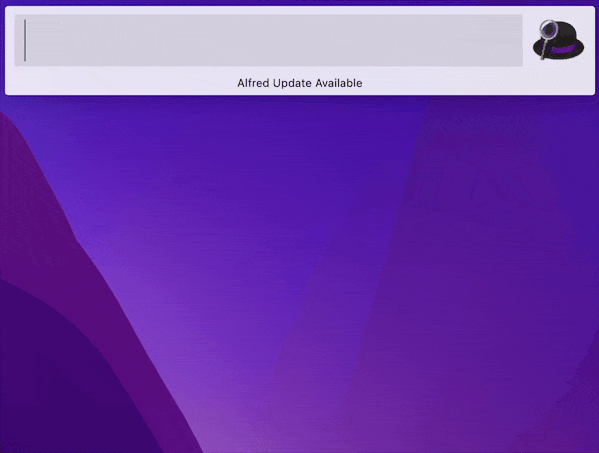

Python boto3 Document Quick Search
==============================================================================

What is this?
------------------------------------------------------------------------------
I create an `Alfred Workflow <https://www.alfredapp.com/workflows/>`_ framework called `Full Text Search Anything <https://github.com/MacHu-GWU/afwf_fts_anything-project>`_. You can bring your own json data, define how you gonna index it, then use Alfred Workflow to search it.

**This project allows you to quickly search and browse Python boto3 api documents**. It automates the creation of the "your own json data" for boto3 document searching.

How it Work?
------------------------------------------------------------------------------
The `build_data.py <./build_data.py>`_ is a crawler that scrape information from https://boto3.amazonaws.com, and generate a json file like this::

    [
        {
            "title": "client | s3.get_object",
            "url": "https://boto3.amazonaws.com/v1/documentation/api/latest/reference/services/s3/client/get_object.html",
            "ngram1": "client",
            "ngram2": "s3",
            "ngram3": "s3",
            "ngram4": "get_object",
            "order": 1
        },
        {
            "title": "client | s3.put_object",
            "url": "https://boto3.amazonaws.com/v1/documentation/api/latest/reference/services/s3/client/put_object.html",
            "ngram1": "client",
            "ngram2": "s3",
            "ngram3": "s3",
            "ngram4": "put_object",
            "order": 1
        },
        ...
    ]

Just run the following script, it will generate the data file and setting file on Git repo root directory.

.. code-block:: bash

    python3 build_data.py

How to Install?
------------------------------------------------------------------------------
**Dependencies**:

    You have to install `the Full-Text-Search Anything Alfred Workflow <https://github.com/MacHu-GWU/afwf_fts_anything-project>`_, make sure you read the document there and successfully configured the sample IMDB top 250 movies dataset working.

**The automate way**:

    We have a `installation script <./install.py>`_, so just do:

    .. code-block:: bash

        python3 -c "$(curl -fsSL https://raw.githubusercontent.com/MacHu-GWU/alfred-python-boto3-ref/main/install.py)"

**The manual way**:

    You can also download the dataset directly from `Release <https://github.com/MacHu-GWU/alfred-python-boto3-ref/releases>`_. Just Download ``python-boto3-data.zip``, extract it in ``${HOME}/.alfred-fts``. Follow Alfred Workflow Config instruction in https://github.com/MacHu-GWU/afwf_fts_anything-project
